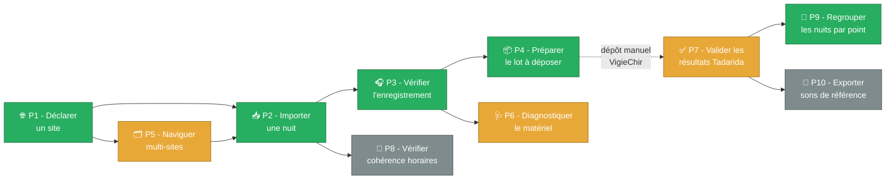

# Parcours utilisateurs

Dix parcours principaux résument l'usage cible de l'application. Ils servent de guide pour le découpage en [épopées et stories](Story%20mapping.md) et reposent tous sur le vocabulaire posé dans le [Modèle conceptuel](Modèle%20conceptuel.md).

> ⚠ Convention de lecture : les parcours sont **étiquetés MoSCoW** dans leur en-tête. Lisez-les comme une **hiérarchie de valeur** plutôt que comme un flux linéaire : la chaîne minimale `P1 → P2 → P3 → P4` (MUST) doit être livrée en premier ; les parcours SHOULD et COULD viennent l'enrichir si la vélocité le permet.

## Topologie des parcours



| Parcours | Persona principal | MoSCoW |
|---|---|---|
| [P1 - Déclarer un site de suivi](#p1---déclarer-un-site-de-suivi-) | Marie | ✅ MUST |
| [P2 - Importer une nuit de capture](#p2---importer-une-nuit-de-capture-) | Marie / Karim / Samuel | ✅ MUST |
| [P3 - Vérifier l'enregistrement par échantillonnage](#p3---vérifier-lenregistrement-par-échantillonnage-) | Marie / Karim / Samuel | ✅ MUST |
| [P4 - Préparer un lot prêt à déposer](#p4---préparer-un-lot-prêt-à-déposer-) | Marie / Karim / Samuel | ✅ MUST |
| [P5 - Naviguer dans plusieurs sites et passages](#p5---naviguer-dans-plusieurs-sites-et-passages-) | Karim / Samuel | 🟠 SHOULD (MUST pour Karim/Samuel) |
| [P6 - Diagnostiquer le matériel](#p6---diagnostiquer-le-matériel-) | Karim / Samuel | 🟠 SHOULD |
| [P7 - Valider les résultats Tadarida](#p7---valider-les-résultats-tadarida-) | Marie / Samuel | 🟠 SHOULD (cible étirable) |
| [P8 - Vérifier la cohérence des horaires de capture](#p8---vérifier-la-cohérence-des-horaires-de-capture-) | Tous | ⚪ COULD |
| [P9 - Regrouper les nuits successives par point](#p9---regrouper-les-nuits-successives-par-point-) | Karim / Samuel | ✅ MUST |
| [P10 - Exporter une bibliothèque de sons de référence](#p10---exporter-une-bibliothèque-de-sons-de-référence-) | Samuel | ⚪ COULD |

---

## P1 - Déclarer un site de suivi 🌐

> **Persona principal** : Marie. **MoSCoW** : MUST. **Objectifs qualité visés** : [O2 Facilité d'apprentissage](../Objectifs%20qualités/Objectifs%20qualités/O2.md), [SC1 Onboarding](../Objectifs%20qualités/Scénario/SC1.md).

Marie a créé son site sur le portail web Vigie-Chiro (<https://vigiechiro.herokuapp.com/>) et a noté son **n° de carré** (6 chiffres) ainsi que les **codes des points** (lettre + chiffre, ex. `A1`, `Z4`). Elle ouvre l'application pour la première fois et veut déclarer ce site afin de pouvoir importer ses nuits ensuite.

1. Marie démarre l'application. L'écran d'accueil détecte qu'aucun site n'est encore déclaré et lui propose une seule action mise en avant : « **Ajouter mon premier site de suivi** ».
2. Elle clique. Un formulaire s'ouvre avec :
    - **N° de carré** (6 chiffres, validé à la saisie : doit faire exactement 6 chiffres, l'application avertit si elle oublie le leading zero pour les départements 1-9)
    - **Nom convivial** (optionnel, pour reconnaître le site facilement, ex. « Étang de la Tuilière »)
    - **Protocole** (préselectionné `Point Fixe`, seul protocole supporté pour le moment)
    - **Liste des points** : Marie ajoute autant de codes que nécessaire (ex. `A1`, `B2`). Pour chaque point, elle peut ajouter des coordonnées GPS et un descriptif (tous optionnels).
3. Marie valide. Le site est enregistré localement. L'écran d'accueil bascule vers la **vue des sites** avec son site fraîchement créé.
4. Elle peut désormais cliquer sur « Importer une nuit » et le formulaire suivant lui propose de choisir le site et le point concernés (parcours [P2](#p2---importer-une-nuit-de-capture-)).

### Règles métier visibles

- R1 : leading zero obligatoire pour les départements 1 à 9 (validation à la saisie).
- R2 : les codes points doivent faire exactement 1 lettre + 1 chiffre.
- R3 : information rappelée mais non bloquante - le protocole Point Fixe attend 2 passages annuels (15 juin → 31 juillet, 15 août → 31 septembre).

---

## P2 - Importer une nuit de capture 📥

> **Persona principal** : Marie / Karim / Samuel. **MoSCoW** : MUST. **Objectifs qualité visés** : [O3 Tenue dans la durée](../Objectifs%20qualités/Objectifs%20qualités/O3.md) (jusqu'à 40 Go), [O7 Intégrité](../Objectifs%20qualités/Objectifs%20qualités/O7.md), [O8 Confidentialité](../Objectifs%20qualités/Objectifs%20qualités/O8.md).

Marie vient de récupérer la carte SD de son enregistreur après une nuit de capture. Elle veut importer cette nuit dans l'application. Le PR a déposé sur la SD un journal du capteur (`LogPR<n>.txt`), un relevé climatique (`PaRec<sn>_THLog.csv`) et plusieurs centaines de fichiers d'enregistrement.

1. Marie ouvre l'application. Elle clique sur « **Importer une nuit** » depuis la vue des sites (parcours [P1](#p1---déclarer-un-site-de-suivi-)) ou directement depuis la barre principale.
2. Une **modale d'import** s'ouvre. Elle demande :
    - **Site et point concernés** (combobox parmi les sites déclarés, et points associés)
    - **Année** et **n° de passage** (préremplis selon la date du jour et le calendrier Vigie-Chiro)
    - **Dossier source** (sélecteur de dossier ou drag-and-drop)
3. Marie pointe sur sa carte SD. L'application **inspecte le dossier** sans rien y écrire et affiche un récapitulatif :
    - journal du capteur détecté ✅, n° de série de l'enregistreur extrait
    - relevé climatique détecté ✅ (ou non, signalé)
    - N enregistrements originaux détectés, taille totale, plage horaire couverte
    - paramètres d'acquisition (Fe, gain, bande de fréquence) extraits du journal du capteur
4. Marie valide « Importer ». L'application **copie de manière protégée** tous les fichiers depuis la SD vers son espace de travail (R9 : aucune écriture sur les originaux SD), en les **renommant** avec le préfixe `CarXXXXXX-AAAA-PassN-YY-` (R6, R7, R8).
5. Une fois la copie terminée, l'application **transforme** automatiquement chaque enregistrement original en séquences d'écoute (expansion ×10 + découpage 5 s, R10). Une barre de progression détaillée informe Marie de l'étape en cours et de l'étape suivante.
6. À la fin, l'application affiche un récapitulatif : nombre de séquences d'écoute produites, durée totale audible, durée écoulée. Le passage est créé en base avec le statut `Transformé`. Marie est invitée à enchaîner sur la **vérification d'enregistrement** (parcours [P3](#p3---vérifier-lenregistrement-par-échantillonnage-)).

### Notes importantes

- L'application doit **tenir des nuits jusqu'à 40 Go** sans freezer l'IHM (cas Samuel en haute saison). L'import et la transformation se font de préférence en arrière-plan, avec possibilité de fermer la fenêtre de progression sans annuler l'opération.
- Si l'utilisateur lance un import alors qu'un autre est en cours, l'application le met en file d'attente plutôt que de refuser ou de paralléliser (préservation des perfs).
- Les **identifiants observateur et participation** présents dans les noms de fichiers ou les CSV sont conservés en local mais ne sont jamais transmis à un service distant (R8 implicite, [SC2](../Objectifs%20qualités/Scénario/SC2.md)).

---

## P3 - Vérifier l'enregistrement par échantillonnage 🎧

> **Persona principal** : Marie / Karim / Samuel. **MoSCoW** : MUST. **Objectifs qualité visés** : [O4 Exactitude lecture audio](../Objectifs%20qualités/Objectifs%20qualités/O4.md), [O7 Intégrité](../Objectifs%20qualités/Objectifs%20qualités/O7.md).

Marie vient d'importer une nuit (parcours [P2](#p2---importer-une-nuit-de-capture-)). Avant de la déposer sur Vigie-Chiro, elle veut **s'assurer que la nuit s'est bien passée et que la qualité audio est exploitable** : pas de saturation parasite, pas d'enregistrement vide, micro fonctionnel. C'est un **sound check global**, distinct de la validation taxonomique espèce par espèce qui viendra plus tard (parcours [P7](#p7---valider-les-résultats-tadarida-)).

1. Marie ouvre la vue détail du passage qui vient d'être importé.
2. Elle clique sur l'onglet **« Vérifier l'enregistrement »**. L'application constitue automatiquement une **sélection d'écoute** : 10-30 séquences d'écoute réparties uniformément sur la nuit (méthode `RéparTemporel` par défaut, R12).
3. La sélection s'affiche sous forme de liste chronologique. Pour chaque séquence : horodatage, durée, fréquence dominante (indicative), bouton ▶ pour écouter.
4. Marie écoute quelques séquences à des moments différents de la nuit. Comme les séquences sont **déjà ralenties ×10 sur disque** (cf. R10), la lecture se fait à vitesse normale, sans transformation à la volée - l'audio est immédiatement audible pour l'oreille humaine.
5. Marie peut compléter sa sélection si elle en ressent le besoin (changer la méthode pour `Aléatoire`, augmenter la taille à 50 séquences, ou ajouter manuellement une séquence à un moment précis).
6. Une fois sa revue faite, elle saisit son **verdict global** dans un menu déroulant : `OK`, `Douteux`, `À jeter`. Elle peut compléter par un commentaire libre (« vent fort vers 02:00, sons à vérifier »).
7. Le passage passe au statut `Vérifié` et le verdict est mémorisé. Marie peut enchaîner sur la préparation du lot ([P4](#p4---préparer-un-lot-prêt-à-déposer-)).

### Règles métier visibles

- R12 : sélection d'écoute constituée automatiquement (méthode `RéparTemporel` par défaut).
- R13 : l'utilisateur reste responsable - aucun seuil minimum d'écoute imposé.
- R14 : un passage avec verdict `À jeter` ne peut pas être inclus dans un lot prêt à déposer (alerte bloquante au moment du parcours [P4](#p4---préparer-un-lot-prêt-à-déposer-)).

---

## P4 - Préparer un lot prêt à déposer 📦

> **Persona principal** : Marie / Karim / Samuel. **MoSCoW** : MUST. **Objectifs qualité visés** : [O7 Intégrité](../Objectifs%20qualités/Objectifs%20qualités/O7.md), [O8 Confidentialité](../Objectifs%20qualités/Objectifs%20qualités/O8.md).

Marie a importé et vérifié une nuit (parcours [P2](#p2---importer-une-nuit-de-capture-) et [P3](#p3---vérifier-lenregistrement-par-échantillonnage-)). Elle veut maintenant **préparer un lot exploitable directement sur le portail Vigie-Chiro** et l'y téléverser manuellement.

1. Marie sélectionne un passage avec verdict `OK` ou `Douteux` (un passage `À jeter` est bloqué, R14).
2. Elle clique sur « **Préparer le lot à déposer** ». L'application vérifie la cohérence du passage :
    - tous les enregistrements originaux ont-ils bien été transformés en séquences d'écoute ?
    - le préfixe `CarXXXXXX-AAAA-PassN-YY-` est-il présent et conforme sur tous les fichiers (R6, R7, R8) ?
    - le journal du capteur et le relevé climatique sont-ils présents ?
3. L'application affiche un **récapitulatif du lot** : nombre de séquences d'écoute, taille totale, chemin du dossier prêt sur le disque. Un bouton « **Ouvrir le dossier dans l'explorateur** » permet à Marie de retrouver les fichiers immédiatement.
4. Marie ouvre le dossier, sélectionne toutes les séquences et les téléverse manuellement sur <https://vigiechiro.herokuapp.com/> via son navigateur (l'application **ne dialogue pas avec le portail**, c'est un dépôt manuel - R8 implicite).
5. Une fois le téléversement effectué côté Vigie-Chiro, Marie revient dans l'application et clique sur « **J'ai déposé le lot** » pour marquer la date de dépôt. Le passage passe au statut `Déposé`.
6. Marie attend ensuite 24-48 h le retour Tadarida pour entamer le parcours [P7](#p7---valider-les-résultats-tadarida-).

---

## P5 - Naviguer dans plusieurs sites et passages 🗂

> **Persona principal** : Karim / Samuel. **MoSCoW** : SHOULD (devient MUST dès qu'on dépasse 3-4 sites - cas par défaut chez Karim et Samuel). **Objectifs qualité visés** : [O5 Capacité d'affichage](../Objectifs%20qualités/Objectifs%20qualités/O5.md), [O6 Modularité](../Objectifs%20qualités/Objectifs%20qualités/O6.md).

Karim revient d'une semaine de chantier sur 3 carrés différents avec 5 enregistreurs déployés en parallèle. Il a 8 nouvelles nuits à traiter. Il a besoin de **se repérer rapidement** dans son volume sans perdre une nuit dans une autre.

1. Karim ouvre l'application. La **vue des sites** lui présente une liste arborescente :
    - Site « Carré 640380 - PARC42 » (dernier passage il y a 2 jours)
       - Point `A1` - 3 passages cette saison, 1 à vérifier
       - Point `B2` - 2 passages cette saison
       - Point `C3` - 0 passage
    - Site « Carré 752204 - ZAC NORD » (dernier passage il y a 5 jours)
       - …
2. Une **vue tabulaire alternative** liste tous les passages tous sites confondus, triables et filtrables par site, point, n° de passage, statut workflow, verdict, date.
3. Karim utilise la vue tabulaire pour repérer les 8 passages au statut `Importé` ou `Transformé` qui attendent sa vérification. Il peut faire un import groupé en sélectionnant plusieurs dossiers SD à la suite (variante du parcours [P2](#p2---importer-une-nuit-de-capture-)).
4. Pour chaque passage, il enchaîne [P3](#p3---vérifier-lenregistrement-par-échantillonnage-) puis [P4](#p4---préparer-un-lot-prêt-à-déposer-) en gardant le contexte global de son chantier visible (badges colorés indiquant le site/chantier).

### Notes pour Samuel

Avec ses 24 enregistreurs en parallèle pendant 40-50 nuits par saison, Samuel a en pratique **plus de 1 000 passages par saison**. La vue tabulaire doit donc :

- supporter des filtres multi-critères performants (R&D potentielle, à arbitrer en équipe étudiante)
- permettre des actions de masse (changement de verdict, suppression, export)
- rester réactive même à plusieurs centaines de lignes (cf. [O5](../Objectifs%20qualités/Objectifs%20qualités/O5.md))

---

## P6 - Diagnostiquer le matériel 🩺

> **Persona principal** : Karim / Samuel. **MoSCoW** : SHOULD. **Objectifs qualité visés** : aucun direct, mais c'est un usage fréquent en exploitation pro.

Karim soupçonne qu'un de ses enregistreurs a un problème (batterie qui faiblit, sonde climatique qui dérive, mises en veille intempestives). Il veut consulter les indicateurs techniques d'une nuit pour décider s'il faut remettre le matériel en service ou le réviser.

1. Karim ouvre la fiche d'un passage (vue détail).
2. Il clique sur l'onglet **« Diagnostic »**. Il y voit :
    - **Graphe de température** sur la nuit (extrait du relevé climatique)
    - **Graphe d'hygrométrie** sur la nuit
    - **Niveau de batterie** au début et à la fin de la nuit (extrait du journal du capteur)
    - **Liste des évènements anormaux** : réveils non programmés, erreurs SD, redémarrages, batterie critique
3. Karim **compare** avec une session précédente du même enregistreur (par n° de série) pour repérer une dérive.
4. Il **exporte** le diagnostic en CSV ou PDF s'il veut le partager avec le fabricant ou l'archiver dans son rapport client.

### Note sur le journal du capteur

Le journal du capteur est **circulaire** sur l'enregistreur : en cas de saturation de la SD, des entrées plus anciennes peuvent avoir été effacées (R19). L'application n'a pas à reconstituer les pertes - elle exploite ce qui est présent et signale les éventuelles incohérences chronologiques.

Si la sonde climatique est absente ou défaillante, le relevé climatique est manquant et l'onglet Diagnostic le signale clairement plutôt que de masquer la section (R20).

---

## P7 - Valider les résultats Tadarida ✅

> **Persona principal** : Marie / Samuel. **MoSCoW** : SHOULD (cible étirable - filet de sécurité MUST si la SAE déborde). **Objectifs qualité visés** : [O4 Exactitude lecture audio](../Objectifs%20qualités/Objectifs%20qualités/O4.md), [O7 Intégrité](../Objectifs%20qualités/Objectifs%20qualités/O7.md).

24-48 h après le dépôt sur Vigie-Chiro (parcours [P4](#p4---préparer-un-lot-prêt-à-déposer-)), Tadarida a analysé les séquences d'écoute et restitué un fichier de **résultats d'identification** (CSV listant les espèces détectées dans chaque séquence, avec leur probabilité). Marie veut **passer en revue ces résultats** pour valider ou corriger les classifications avant que les données ne soient consolidées dans la base nationale.

1. Marie télécharge le fichier de résultats depuis le portail Vigie-Chiro et le sauvegarde sur son disque.
2. Dans l'application, elle ouvre la fiche du passage concerné et clique sur « **Importer les résultats Tadarida** ». Elle pointe sur le fichier téléchargé.
3. L'application parse le fichier (formats `Brut` ou `Vu` reconnus, R17), associe chaque ligne à la séquence d'écoute correspondante en base, et affiche la **vue de validation** :
    - liste des observations à gauche (triable par séquence, taxon Tadarida, probabilité, statut)
    - panneau de détail à droite : taxon proposé, probabilité, fréquence médiane, lecteur audio pour la séquence, bouton de validation
4. Marie sélectionne une observation. La séquence d'écoute associée se charge dans le lecteur (déjà ralentie ×10, lecture immédiate). Elle peut aussi visualiser la **forme d'onde** et un **spectrogramme** (avec **zoom variable**, opération très fréquente en analyse acoustique).
5. Marie écoute, regarde, décide :
    - si le taxon Tadarida lui semble correct, elle valide en un clic (`taxon observateur = taxon Tadarida`, R15)
    - sinon, elle saisit un autre taxon dans le sélecteur. L'observation passe en statut `corrigée` (R16)
    - elle peut ajouter un commentaire libre (« pic 39 kHz, morphologie atypique »)
6. Marie peut **filtrer** par taxon, par groupe taxonomique (« toutes les pipistrelles », « tous les murins »), par seuil de probabilité, par plage horaire.
7. Elle peut **quitter et reprendre plus tard** : son contexte (dernière observation vue, filtres actifs) est restauré. La validation peut s'étaler sur plusieurs jours sans rien perdre.
8. Une fois la revue terminée, Marie exporte le **fichier de résultats validés** (`*_Vu.csv`) et le téléverse sur Vigie-Chiro pour finaliser sa contribution.

### Notes importantes

- **Les probabilités Tadarida ne sont pas fiables** au sens strict : il arrive régulièrement qu'une observation à 99 % soit fausse et qu'une observation à 20 % soit correcte. La probabilité reste une **heuristique de tri** utile, mais pas un raccourci de validation automatique.
- **Deux modes de validation coexistent** (R18) :
    - **Mode inventaire** : Marie cherche juste à savoir quelles espèces sont présentes sur son site. Une fois une espèce validée avec confiance sur une nuit, les autres détections de la même espèce sur la même nuit ne sont plus validées.
    - **Mode activité** : Samuel cherche à quantifier l'activité. Toutes les observations doivent être passées en revue pour produire des statistiques d'activité fiables.

  L'utilisateur choisit le mode au démarrage du parcours (configurable par passage).

---

## P8 - Vérifier la cohérence des horaires de capture 🌅

> **Persona principal** : Tous (utile dès qu'on a saisi les coordonnées GPS du point). **MoSCoW** : COULD. **Objectifs qualité visés** : aucun direct - c'est un confort de contrôle qualité.

Le protocole Vigie-Chiro Point Fixe demande que l'enregistreur soit **allumé 30 min avant le coucher du soleil et éteint 30 min après son lever**. Marie veut vérifier qu'elle a bien programmé son enregistreur pour la nuit du jour J en fonction de son site.

1. Marie ouvre la fiche d'un passage. Un encart « **Cohérence horaires** » présente :
    - heure de coucher de soleil **calculée localement** d'après les coordonnées GPS du point d'écoute et la date de capture
    - heure de lever de soleil idem
    - **plage théorique attendue** (coucher - 30 min → lever + 30 min)
    - **plage effective enregistrée** (extraite du journal du capteur : heure de premier déclenchement → heure de mise en veille)
    - écart : ✅ conforme / ⚠ écart de N minutes / ❌ écart majeur
2. Si la plage est conforme, Marie a un retour visuel rassurant. Sinon, elle peut investiguer dans le journal du capteur (parcours [P6](#p6---diagnostiquer-le-matériel-)).

### Précondition

Ce parcours suppose que les **coordonnées GPS** ont été saisies pour le point lors de la déclaration du site (parcours [P1](#p1---déclarer-un-site-de-suivi-)) ou ajoutées par la suite. Sans coordonnées, l'encart est masqué et l'utilisateur invité à compléter sa fiche site.

---

## P9 - Regrouper les nuits successives par point 🔁

> **Persona principal** : Karim / Samuel. **MoSCoW** : MUST. **Objectifs qualité visés** : [O5 Capacité d'affichage](../Objectifs%20qualités/Objectifs%20qualités/O5.md), confort de productivité.

Samuel a déployé un enregistreur sur le même point pendant **4 nuits successives** dans le cadre d'un passage Vigie-Chiro. Il vient de récupérer les résultats Tadarida pour les 4 nuits et entame la validation taxonomique (parcours [P7](#p7---valider-les-résultats-tadarida-)). Il sait qu'une espèce détectée et validée sur la nuit 1 sera très probablement aussi présente sur les nuits 2, 3 et 4 - il veut **gagner du temps** en regroupant les nuits.

1. Samuel ouvre la vue des sites et sélectionne un point. Il voit la liste des passages sur ce point pour la saison en cours, ordonnés chronologiquement.
2. Il sélectionne plusieurs passages successifs (4 nuits) avec un Ctrl+clic ou en glissant la sélection.
3. Il clique sur « **Regrouper pour validation** ». L'application ouvre une **vue de validation regroupée** :
    - les observations des 4 nuits sont fusionnées et triées par espèce
    - un compteur indique « 4 nuits, 12 espèces détectées, 2 870 observations au total »
    - Samuel peut alors valider une espèce **une seule fois pour les 4 nuits** : son verdict s'applique aux observations de la même espèce sur toute la période regroupée
4. Le mode regroupé respecte le **mode de validation** choisi (inventaire ou activité, R18) :
    - en mode inventaire, valider une espèce sur la 1re nuit la marque comme présente sur le site, les autres détections (mêmes nuits ou nuits suivantes du regroupement) sont ignorées
    - en mode activité, le regroupement est plus formellement « rouler par espèce » : on valide chaque détection mais le tri par espèce permet d'enchaîner rapidement

### Note de complexité

Ce parcours est jugé **MUST par l'équipe pédagogique** mais Samuel le considérait comme « utile mais peut-être trop complexe ». Si la vélocité étudiante ne tient pas, on peut le rétrograder en SHOULD - mais il **conditionne la productivité** des utilisateurs avec beaucoup de passages (Karim et Samuel).

---

## P10 - Exporter une bibliothèque de sons de référence 🎼

> **Persona principal** : Samuel. **MoSCoW** : COULD. **Objectifs qualité visés** : aucun direct - c'est une fonctionnalité bonus.

Samuel a validé plusieurs centaines d'observations sur la saison. Il veut **constituer une petite bibliothèque de sons de référence** par espèce (les meilleurs exemples qu'il a entendus) pour la transmettre à un débutant qu'il forme, ou pour son propre usage pédagogique.

1. Pendant la validation (parcours [P7](#p7---valider-les-résultats-tadarida-)), Samuel marque certaines observations comme « **séquence de référence** » via un bouton dédié.
2. Quand il a fini de constituer sa sélection, il ouvre le menu « **Exporter** » → « **Bibliothèque de sons de référence** ».
3. L'application produit un dossier organisé par espèce :
   ```
   bibliotheque/
     Pippip - Pipistrellus pipistrellus/
       Car640380-2026-Pass2-Z1-...20260422_212817_003.wav
       Car640380-2026-Pass2-Z1-...20260423_001435_001.wav
     Nyclei - Nyctalus leisleri/
       ...
   ```
4. Samuel peut zipper le dossier et le partager.

### Variante

Au lieu d'un dossier de fichiers WAV, l'application peut produire un **document récapitulatif** (HTML ou PDF) avec, par espèce : nom latin, nom vernaculaire, exemples de spectrogrammes, lien vers les fichiers WAV correspondants. Plus utile pour la transmission pédagogique. À arbitrer en équipe étudiante selon la complexité.

---

## Couverture par persona

| Parcours | Marie | Karim | Samuel |
|---|:---:|:---:|:---:|
| P1 - Déclarer un site | ✅ ⭐ | ✅ | ✅ |
| P2 - Importer une nuit | ✅ ⭐ | ✅ ⭐ | ✅ ⭐ |
| P3 - Vérifier l'enregistrement | ✅ ⭐ | ✅ | ✅ |
| P4 - Préparer le lot | ✅ ⭐ | ✅ | ✅ |
| P5 - Multi-sites | (1 site) | ✅ ⭐ | ✅ ⭐ |
| P6 - Diagnostic matériel | ✓ | ✅ ⭐ | ✅ |
| P7 - Validation Tadarida | ✅ ⭐ | ✓ | ✅ ⭐ |
| P8 - Cohérence horaires | ✓ | ✓ | ✅ |
| P9 - Regroupement nuits | (rare) | ✅ | ✅ ⭐ |
| P10 - Sons de référence | (non) | (non) | ✅ |

⭐ = parcours central pour la persona, ✅ = parcours fréquent, ✓ = parcours occasionnel.
