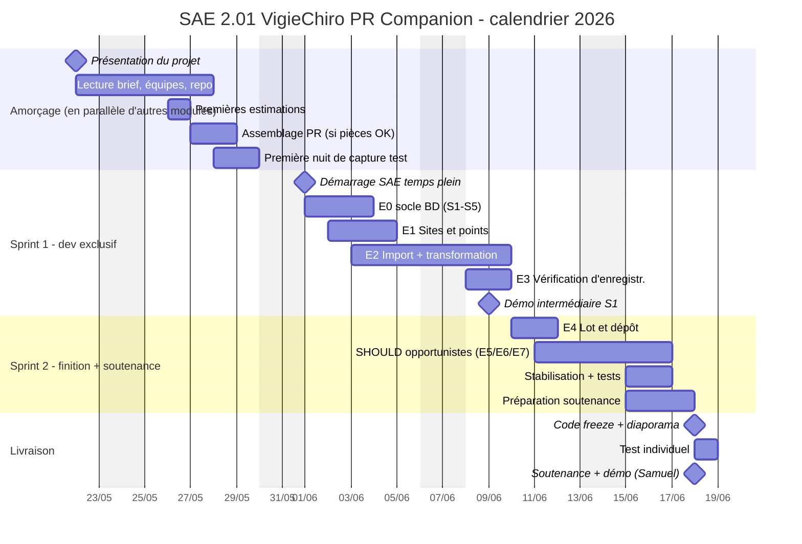

# Planification

Le développement est découpé en **2 sprints** alignés sur la stratégie définie dans le [périmètre MVP](Périmètre%20MVP.md), avec en amont une **fenêtre d'amorçage** où la SAE coexiste avec d'autres modules.

> ⚠️ Cette planification est **prospective**. Vous la révisez en équipe au démarrage de chaque sprint en fonction de votre vélocité réelle et des aléas. Le Gantt n'est pas une promesse de livraison à la journée près — c'est un cadre pour piloter votre progression et détecter les dérives.

## Vue d'ensemble

## Détail par phase

### Amorçage — 22/05 → 31/05 (6 jours ouvrés, en parallèle d'autres modules)

L'amorçage ne demande **pas de développement intensif** : c'est le moment de poser les fondations sans interférer avec les autres cours.

| Activité | Sortie attendue |
|---|---|
| Lecture du brief par toute l'équipe | Vocabulaire partagé sur le modèle conceptuel, les parcours et les épopées |
| Constitution des équipes | Rôles informels assumés (lead BD, lead UI, lead audio…) |
| **Téléchargement du full dataset** (~10 Go via Filesender RENATER) | Archive décompressée dans `data/`, lien expire — à faire en priorité |
| Clonage du repo GitHub Classroom, vérification que le squelette compile | Une PR pilote fusionnée pour valider le workflow Git/CI |
| Premières estimations en étoiles sur les stories MUST | Estimations partagées, désaccords identifiés pour discussion |
| **Assemblage du PR de l'équipe** (séance encadrée, si pièces reçues) | PR matériel qui démarre, se met en veille, écrit sur la SD |
| Première nuit de capture test avec ce PR | Un dossier de session « maison » qui complète le sample fourni |

**Sortie attendue à la fin de l'amorçage** : repo opérationnel CI verte sur `main`, full dataset téléchargé, équipe prête à coder le 01/06 au matin.

### Sprint 1 — 01/06 → 09/06 (7 jours ouvrés, dev exclusif)

**Objectif** : livrer la chaîne fil rouge MUST complète : un utilisateur peut **déclarer un site**, **importer une nuit**, **vérifier l'enregistrement** et **préparer le lot** à déposer.

**Stories MUST visées** :

| Épopée | Stories | Charge ★ |
|---|---|---|
| [E0](../Analyse%20et%20conception/Story%20mapping/E0%20-%20Fondations%20de%20persistance.md) - Fondations | S1, S2, S3, S4, S5 | 14 ★ |
| [E1](../Analyse%20et%20conception/Story%20mapping/E1%20-%20Gérer%20ses%20sites%20et%20points%20de%20suivi.md) - Sites et points | S1, S2, S3, S4, S5 | 10 ★ |
| [E2](../Analyse%20et%20conception/Story%20mapping/E2%20-%20Importer%20et%20transformer%20une%20nuit.md) - Import + transformation | S1, S2, S3, S4, S5, S6, S7 | 21 ★ |
| [E3](../Analyse%20et%20conception/Story%20mapping/E3%20-%20Vérifier%20la%20qualité%20d%27enregistrement.md) - Vérification | S1, S2, S3, S4, S5 | 9 ★ |

**Charge cible Sprint 1** : ~54 ★ MUST. C'est ambitieux — anticipez de devoir simuler certaines parties si la vélocité ne suit pas.

**Point de risque principal** : [E2.S6](Story%20mapping/E2%20-%20Importer%20et%20transformer%20une%20nuit.md#e2s6) (transformation ×10 + chunks 5 s, ★★★★★). **À sécuriser dès le premier jour** : sans elle, toute la chaîne fil rouge dérape.

**Démo de fin de Sprint 1** : importer le dossier d'une nuit de capture, voir les séquences ralenties générées, écouter quelques-unes via la vue échantillonnée, saisir un verdict global. La préparation du lot (E4) reste pour le Sprint 2.

### Sprint 2 — 10/06 → 17/06 (6 jours ouvrés, dev exclusif)

**Objectif** : **boucler la chaîne fil rouge** ([E4](../Analyse%20et%20conception/Story%20mapping/E4%20-%20Préparer%20et%20tracer%20le%20dépôt%20VigieChiro.md)), saisir des **SHOULD opportunistes** en fonction de la vélocité observée, **stabiliser**, et **préparer la soutenance**.

**Stories MUST restantes** :

| Épopée | Stories | Charge ★ |
|---|---|---|
| [E4](../Analyse%20et%20conception/Story%20mapping/E4%20-%20Préparer%20et%20tracer%20le%20dépôt%20VigieChiro.md) - Lot et dépôt | S1, S2, S3 | 5 ★ |

**SHOULD opportunistes** (à arbitrer en début de sprint en fonction de la vélocité Sprint 1) :

- [E0.S6](../Analyse%20et%20conception/Story%20mapping/E0%20-%20Fondations%20de%20persistance.md#e0s6), [E0.S7](../Analyse%20et%20conception/Story%20mapping/E0%20-%20Fondations%20de%20persistance.md#e0s7) - reprises d'opérations interrompues (★★★★ + ★★★ = 7 ★) — robustesse
- [E5.S1](../Analyse%20et%20conception/Story%20mapping/E5%20-%20Naviguer%20dans%20le%20volume%20multi-sites.md#e5s1), [E5.S2](../Analyse%20et%20conception/Story%20mapping/E5%20-%20Naviguer%20dans%20le%20volume%20multi-sites.md#e5s2) - vues multi-sites (3 ★ + 3 ★ = 6 ★) — devient MUST de fait pour Karim/Samuel
- [E6.S1](../Analyse%20et%20conception/Story%20mapping/E6%20-%20Diagnostiquer%20le%20matériel.md#e6s1), [E6.S2](../Analyse%20et%20conception/Story%20mapping/E6%20-%20Diagnostiquer%20le%20matériel.md#e6s2) - diagnostic (3 ★ + 3 ★ = 6 ★) — utile dès qu'on veut visualiser la qualité matérielle
- [E7.S1](../Analyse%20et%20conception/Story%20mapping/E7%20-%20Valider%20les%20résultats%20Tadarida.md#e7s1) à [E7.S5](../Analyse%20et%20conception/Story%20mapping/E7%20-%20Valider%20les%20résultats%20Tadarida.md#e7s5), [E7.S7](../Analyse%20et%20conception/Story%20mapping/E7%20-%20Valider%20les%20résultats%20Tadarida.md#e7s7) - validation Tadarida (~15 ★) — cible étirable principale

**Préparation soutenance** (3 derniers jours du sprint, en parallèle des derniers développements) : démo scriptée, diaporama, répétitions.

**Démo de fin de Sprint 2 (= soutenance)** : chaîne fil rouge complète sur le jeu de données, plus toutes les fonctionnalités SHOULD livrées. Si certaines parties ne sont pas allées au bout, **plan d'action explicite** sur ce qui reste à faire (cf. [Périmètre MVP](Périmètre%20MVP.md) section « Évolutions du périmètre »).

## Indicateurs de pilotage

À surveiller chaque jour, et formellement en fin de Sprint 1 :

| Indicateur | Cible | Alerte | Action si alerte |
|---|---|---|---|
| Stories MUST franchies | ≥ 80 % du sprint planifié | < 60 % | Demander une revue d'arbitrage à l'équipe pédagogique : que coupe-t-on ? |
| Couverture de tests sur le code métier | ≥ 70 % | < 50 % | Ralentir le sprint suivant pour rattraper les tests. Le sprint final sera ingérable sans cela. |
| CI verte sur `main` | 100 % | < 95 % | Refus de merge tant que CI rouge. Pas de « on corrigera plus tard ». |
| Stories en cours non finies | ≤ 1 par dev | ≥ 3 par dev | Stop the line : on finit avant de commencer. |
| [E2.S6](../Analyse%20et%20conception/Story%20mapping/E2%20-%20Importer%20et%20transformer%20une%20nuit.md#e2s6) (transformation audio) | livrée fin Sprint 1 J3 max | toujours en cours J4 | Demander un point technique en urgence avec l'équipe pédagogique. |

## Et si on n'y arrive pas ?

C'est un **scénario à anticiper**, pas un échec. Voir [Périmètre MVP](Périmètre%20MVP.md) section « Évolutions du périmètre » pour la stratégie de repli :

- Démo convaincante du **fil rouge bout-en-bout**, quitte à ce que certaines parties soient simulées (transformation audio qui rejoue un fichier pré-calculé par exemple).
- **Plan d'action explicite** sur ce qui reste à faire, avec effort estimé par story.
- **Communiquez tôt** : une dérive signalée en début de Sprint 2 se rattrape ; une dérive révélée le 17/06 ne se rattrape plus.

**Une démo bout-en-bout, même partiellement « truquée », vaut mieux qu'une chaîne complète qui s'arrête à mi-parcours.**
