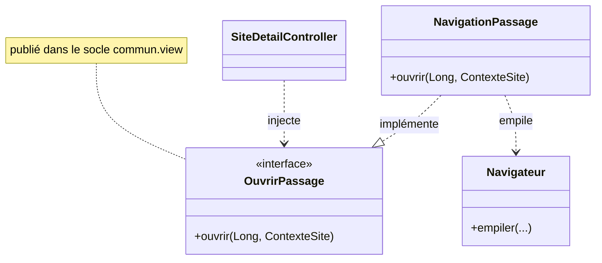

# Navigation et chrome

Le **chrome** (la fenêtre : barre de navigation, zone centrale, pied) est porté par le socle
[`commun.view`](https://github.com/IUTInfoAix-S201/vigiechiro-pr-companion/tree/main/src/main/java/fr/univ_amu/iut/commun/view).
Les **fonctionnalités** n'ont pas de fenêtre à elles : elles publient un écran dans la **zone
centrale** via le [`Navigateur`](https://github.com/IUTInfoAix-S201/vigiechiro-pr-companion/blob/main/src/main/java/fr/univ_amu/iut/commun/view/Navigateur.java).

## Le chrome (`MainView` + `MainController`)

`MainView.fxml` est un `BorderPane` :

- **haut** : titre, bouton ← Retour, fil d'Ariane ;
- **centre** : un **`ScrollPane` permanent** dont le `MainController` échange le **contenu** à chaque
  navigation (barre verticale dès que l'écran dépasse la hauteur ; la nav et le pied restent fixes) ;
- **bas** : pied de page.

Le [`MainController`](https://github.com/IUTInfoAix-S201/vigiechiro-pr-companion/blob/main/src/main/java/fr/univ_amu/iut/commun/view/MainController.java)
lie le centre à la `vueCentraleProperty()` du `Navigateur`, reconstruit le fil d'Ariane à chaque
changement d'historique, et pose les raccourcis (Alt+← retour, Alt+Début accueil). Les changements
d'écran arrivent en léger fondu.

## Le `Navigateur` : une pile d'écrans vivants

Le `Navigateur` (singleton Guice) tient un **historique** (pile d'`EtapeNavigation`, base = Accueil)
dont le **sommet** alimente la zone centrale. Les écrans restent **vivants** dans la pile : revenir
ré-affiche l'instance précédente, **état préservé**.

| Méthode | Effet |
|---|---|
| `ouvrirRacine(vue, id, libellé, controleur)` | Réinitialise l'historique à `[Accueil, écran]` (entrée depuis une carte d'accueil). |
| `empiler(vue, id, libellé, controleur)` | Drill-down : empile un écran. **Anti-ré-entrance** : si l'`id` est déjà présent, on dépile jusqu'à lui et on le remplace. |
| `revenir()` | ← Retour : dépile d'un cran. |
| `revenirAIndex(i)` | Remonte à l'ancêtre `i` (clic d'un segment du fil). |
| `afficherAccueil()` | Dépile tout (retour à l'accueil global). |

!!! note "Le fil d'Ariane est hybride"
    Le **← Retour** suit l'**historique** réel ; le **fil d'Ariane** suit l'**emplacement
    hiérarchique** que l'écran déclare (cf. `EmplacementNavigation` ci-dessous), sinon il retombe sur
    l'historique.

## Les contrats optionnels d'un écran

[`EtapeNavigation`](https://github.com/IUTInfoAix-S201/vigiechiro-pr-companion/blob/main/src/main/java/fr/univ_amu/iut/commun/view/EtapeNavigation.java)
mémorise le `controller` de l'écran et en dérive, par `instanceof`, des **contrats optionnels** que le
`Navigateur` honore :

| Contrat (`commun.view`) | Quand l'implémenter | Effet |
|---|---|---|
| [`GardeQuitter`](https://github.com/IUTInfoAix-S201/vigiechiro-pr-companion/blob/main/src/main/java/fr/univ_amu/iut/commun/view/GardeQuitter.java) | L'écran a une **saisie non enregistrée** | Demande confirmation avant de quitter |
| [`EmplacementNavigation`](https://github.com/IUTInfoAix-S201/vigiechiro-pr-companion/blob/main/src/main/java/fr/univ_amu/iut/commun/view/EmplacementNavigation.java) | L'écran a une **place hiérarchique** (ex. `Mes sites › Carré N › Passage`) | Alimente le fil d'Ariane (segments cliquables) |
| [`RafraichirAuRetour`](https://github.com/IUTInfoAix-S201/vigiechiro-pr-companion/blob/main/src/main/java/fr/univ_amu/iut/commun/view/RafraichirAuRetour.java) | L'écran affiche des données qu'une **sous-activité peut modifier** | Recharge ses données quand on y **revient** |

!!! example "Pourquoi `RafraichirAuRetour` existe"
    M-Passage ouvre M-Qualification ; un verdict y fait avancer le statut. Sans contrat, revenir
    ré-afficherait le passage **périmé** (instance vivante). En l'implémentant, le `Navigateur` le
    recharge au retour. M-Multisite et M-Site-detail (tableaux de passages) l'implémentent aussi.

## Ouvrir une autre feature sans en dépendre

C'est le point clé du **découplage inter-feature** : une feature ne doit pas dépendre du `view`/`viewmodel`
d'une autre (règle ArchUnit `pas_de_dependance_inter_feature_vers_la_vue`). Le patron `Ouvrir*` résout
ça par **inversion de dépendance** : le contrat vit dans le socle, l'appelant et l'implémenteur en
dépendent tous deux (jamais l'un de l'autre).

1. Le **socle** publie l'interface `OuvrirPassage` dans `commun.view`.
2. La feature `passage` l'**implémente** dans `NavigationPassage` (charge le FXML via la
   `controllerFactory` Guice, appelle `controleur.ouvrirSur(...)`, puis `navigateur.empiler(...)`).
3. `PassageModule` la **binde** : `bind(OuvrirPassage.class).to(NavigationPassage.class);`.
4. `sites` **injecte** `OuvrirPassage` et appelle `ouvrir(...)` — sans jamais voir `passage.view`.

Contrats existants : `OuvrirSite`, `OuvrirPassage`, `OuvrirVerification`, `OuvrirImportation`,
`OuvrirLot`, `OuvrirValidation`, `OuvrirDiagnostic`.

## Cartes d'accueil et compteurs

L'accueil agrège ce que **chaque feature publie** au conteneur (multibinding Guice, cf.
[Injection](injection.md)) : une `ActiviteAccueil` (la carte cliquable) et, le cas échéant, un
`IndicateurAccueil` (un compteur du tableau de bord). Le `MainController` peuple les cartes
automatiquement : pour qu'un nouvel écran apparaisse à l'accueil, il suffit de publier son
`ActiviteAccueil`.

---

Pour câbler tout cela à l'injection, voir **[Injection (Guice)](injection.md)**.
