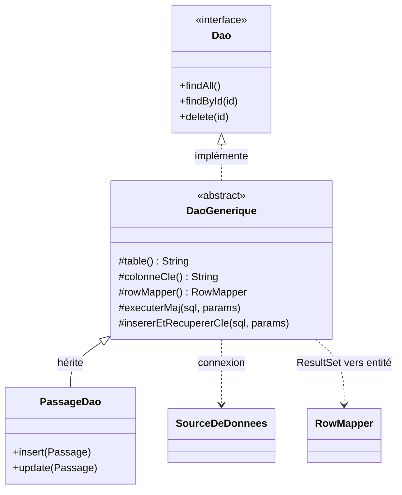

# Persistance

La persistance est **locale** : une base **SQLite** fichier, sans serveur. La couche vit dans
[`commun.persistence`](https://github.com/IUTInfoAix-S201/vigiechiro-pr-companion/tree/main/src/main/java/fr/univ_amu/iut/commun/persistence)
(infra technique) ; le **SQL métier** de chaque entité vit dans les `*/model/dao/` de sa feature.

!!! abstract "Cette page = le *mécanisme*, pas le *modèle*"
    Pour **quelles données** sont stockées (entités, 19 tables, MCD du brief, correspondance
    concept → record → table), voir [Modèle de données et domaine](modele-de-donnees.md). Cette
    page-ci décrit **comment** on y accède : source de données, migrations, DAO, transactions.

!!! warning "Frontière"
    `commun.persistence` et tous les `..model.dao..` **ignorent JavaFX** (tests
    `persistance_sans_javafx` et `view_sans_jdbc`). La couche données est réutilisable et testable
    seule.

## La source de données

[`SourceDeDonnees`](https://github.com/IUTInfoAix-S201/vigiechiro-pr-companion/blob/main/src/main/java/fr/univ_amu/iut/commun/persistence/SourceDeDonnees.java)
est l'**unique** classe qui connaît l'URL JDBC (`jdbc:sqlite:<workspace>/vigiechiro.db`). Bindée en
**singleton** Guice, elle fournit des `Connection` ; DAO, unité de travail et migration la reçoivent
et ignorent tout du driver.

!!! note "Intégrité référentielle activée explicitement"
    SQLite n'applique les clés étrangères que si on le demande. Chaque connexion active
    `PRAGMA foreign_keys = ON` (objectif qualité O7). En test, le `Workspace` pointe un `@TempDir` :
    base **jetable** par test.

## Les migrations de schéma

[`MigrationSchema`](https://github.com/IUTInfoAix-S201/vigiechiro-pr-companion/blob/main/src/main/java/fr/univ_amu/iut/commun/persistence/MigrationSchema.java)
applique des scripts **versionnés**
[`src/main/resources/db/migration/V0x__*.sql`](https://github.com/IUTInfoAix-S201/vigiechiro-pr-companion/tree/main/src/main/resources/db/migration)
et trace les versions dans une table `schema_version`. C'est **idempotent** : à la réouverture d'une
base existante, les versions déjà présentes sont ignorées (« base présente → réutilisée »).

État actuel : `V01__schema.sql` (toutes les tables) · `V02__seed_taxons.sql` (données de référence) ·
`V03__perf_indexes.sql` (index).

!!! tip "Ajouter une migration"
    1. Créez `db/migration/V0n__xxx.sql` (numéro suivant).
    2. **Ajoutez son nom au tableau `MIGRATIONS`** de `MigrationSchema` — **l'ordre fait foi**.

    `App` appelle `MigrationSchema.migrer()` au démarrage ; les tests le font sur leur base jetable.

## Le patron DAO

Pas d'ORM : des **DAO** en `PreparedStatement`. La base technique
[`DaoGenerique<T, ID>`](https://github.com/IUTInfoAix-S201/vigiechiro-pr-companion/blob/main/src/main/java/fr/univ_amu/iut/commun/persistence/DaoGenerique.java)
offre `findAll` / `findById` / `delete` **gratuitement** dès qu'un DAO concret fournit son `table()`,
sa `colonneCle()` et son `RowMapper`. Seules les écritures dépendant des colonnes
(`insert` / `update`) restent à écrire, via les helpers `executerMaj(...)` et
`insererEtRecupererCle(...)`.



(Les classes sont génériques : `Dao<T, ID>`, `DaoGenerique<T, ID>`, `RowMapper<T>`.)

Le [`RowMapper<T>`](https://github.com/IUTInfoAix-S201/vigiechiro-pr-companion/blob/main/src/main/java/fr/univ_amu/iut/commun/persistence/RowMapper.java)
transforme une ligne de `ResultSet` en entité (un `record` immuable).

## Transactions

Par défaut, chaque appel DAO **s'auto-commit**. Quand plusieurs écritures doivent réussir ou échouer
**ensemble** (ex. créer un passage *et* sa session), on les regroupe dans une
[`UniteDeTravail`](https://github.com/IUTInfoAix-S201/vigiechiro-pr-companion/blob/main/src/main/java/fr/univ_amu/iut/commun/persistence/UniteDeTravail.java) :

```java
uniteDeTravail.executer(connexion -> {
    // plusieurs écritures sur la MÊME connexion...
}); // commit si tout passe, rollback sinon
```

Une exception dans le bloc déclenche un **rollback** : la base reste cohérente (objectif intégrité /
résilience O7). Les erreurs SQL sont remontées en
[`DataAccessException`](https://github.com/IUTInfoAix-S201/vigiechiro-pr-companion/blob/main/src/main/java/fr/univ_amu/iut/commun/persistence/DataAccessException.java)
(non vérifiée).

---

Les DAO et services sont assemblés par Guice : voir **[Injection (Guice)](injection.md)**.
